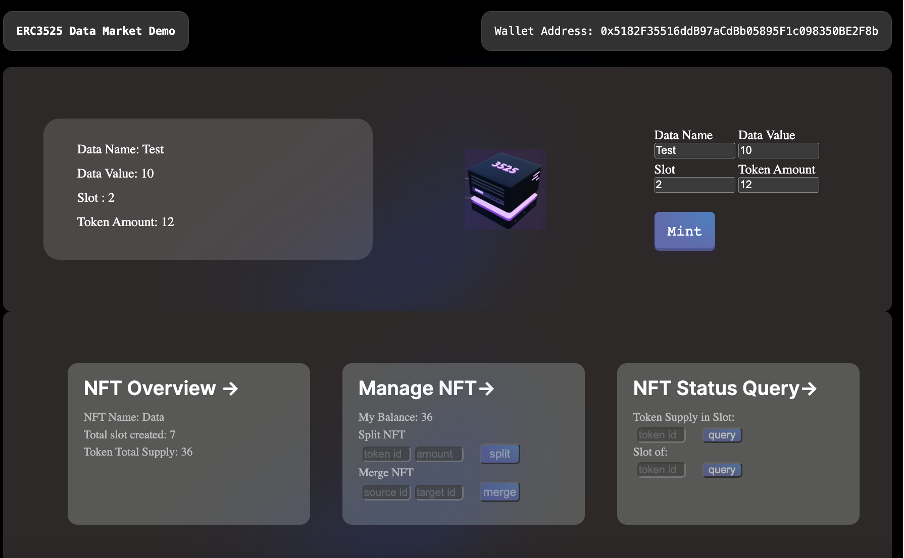

## ERC3525 Data Market Demo



ERC3525 Data Market is a blockchain-based decentralized marketplace that aims to facilitate the exchange of data between parties in a secure and transparent manner.

The data NFTs are implemented using EIP-3525 standards. It combines the quantitative attributes of fungible tokens with the descriptive features of non-fungible tokens (NFTs) to create a new type of digital asset that can represent partial ownership or partial shares of an underlying asset. 

 ERC3525 Data Market has the potential to transform the way data is traded, enabling businesses and organizations to unlock the full value of their data assets while preserving privacy and control over their data.

First, run the development server:

```bash
npm run dev
```

Open [http://localhost:3000](http://localhost:3000) with your browser to see the result.

